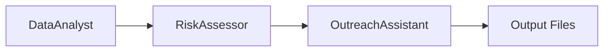

# HospitalGPT2: Multi-Agent Population Health Platform

HospitalGPT2 is a modular, agent-based platform for population health management, built with LangGraph and DeepSeek R1 (via OpenRouter). It provides a modern, interactive dashboard for analyzing patient cohorts, risk stratification, and generating personalized outreach—all powered by reusable agent subfunctions and a robust multi-agent workflow.

## Architecture Overview

The system is organized as follows:

- **/agents/**: Contains modular agents (Data Analyst, Risk Assessor, Outreach Assistant, Workflow)
- **/utils/**: Shared utilities for FHIR data parsing, patient filtering, and API helpers
- **/data/**: Patient data in JSON format
- **/output/**: All generated outputs (summary, risk labels, outreach emails)
- **/ui/**: Streamlit dashboard for interactive analysis
- **/prompts/**: (Optional) Prompt templates for agent LLMs

### Agent Workflow (LangGraph)



- **DataAnalyst**: Summarizes patient cohort and generates markdown summary
- **RiskAssessor**: Assigns risk labels and explanations
- **OutreachAssistant**: Generates personalized outreach emails

## Running the Platform

1. Install dependencies:
   ```bash
   pip install -r requirements.txt
   ```
2. Configure your `.env` file with your OpenRouter API key and model (see `.env.example`).
3. Launch the dashboard:
   ```bash
   streamlit run ui/app.py
   ```

## User Interface (UI) Overview

- **Analyze Patients**: Button to trigger the full analysis pipeline
- **Patient List**: Table of all patients with demographics
- **Summary Statistics**: Markdown summary of the cohort
- **Risk Assessment**: Color-coded risk levels and explanations
- **Outreach Emails**: Professional, personalized email drafts for each patient


## Comparison: Legacy Script vs. Agent-Based Pipeline

| Feature                        | Legacy Script (`hospitalgpt.py`) | Agent-Based Pipeline (LangGraph) |
|--------------------------------|----------------------------------|----------------------------------|
| Architecture                   | Monolithic, procedural           | Modular, multi-agent (LangGraph) |
| Extensibility                  | Low                              | High (easy to add/replace agents)|
| Model Integration              | OpenAI/Mixtral (via OAI config)  | DeepSeek R1 via OpenRouter       |
| Output Files                   | CSV, plain text                  | Markdown, JSON, emails           |
| UI                             | None/CLI only                    | Modern Streamlit dashboard       |
| Patient Data Handling          | Script-level logic               | Reusable utilities, FHIR support |
| Risk & Outreach Logic          | Inline, hardcoded                | Dedicated agents, prompt-driven  |
| Parallel/Async Processing      | No                               | Possible with LangGraph          |
| Error Handling                 | Minimal                          | Robust, user-facing in UI        |
| Customization                  | Difficult                        | Easy via agent prompts/functions |

**Summary:**
- The agent-based pipeline is more maintainable, extensible, and user-friendly.
- The UI enables non-technical users to interact with the system and review results visually.
- The modular agent design allows for rapid experimentation and future expansion.

---
